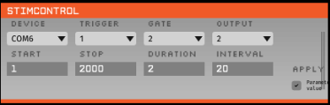

# OpenEphys plugin interface to Arduino for TTL stimulation

Connects to an Arduino to allow TTL pulses on a given Arduino output pin starting and ending at user specified times with a given duration of and interval between pulses.

## Installation

You need to compile the plugin following the instructions given here:

https://open-ephys.github.io/gui-docs/Developer-Guide/Compiling-plugins.html

You also need to upload the Code in the Arduino/StimulationTimer folder to the Arduino before using the plugin.

## Usage

This should be fairly self-evident. Identifying the right device can be a bit of a pain and you can't rename them in the plugin at the moment.

### Notes
Trigger and gate pins do nothing at the moment.

Plugin is compliant with open-ephys release v0.6.2