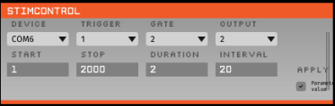

# OpenEphys plugin interface to Arduino for TTL stimulation

Connects to an Arduino to allow TTL pulses on a given Arduino output pin starting and ending at user specified times with a given duration of and interval between pulses.

## Installation

You need to compile the plugin following the instructions given here:

https://open-ephys.github.io/gui-docs/Developer-Guide/Compiling-plugins.html

You also need to upload the Code in the Arduino/StimulationTimer folder to the Arduino before using the plugin.

## Usage

This should be fairly self-evident. Identifying the right device can be a bit of a pain and you can't rename them in the plugin at the moment.

The plugin now supports two serial protocols for sending stimulation settings to
the Arduino:

1. **String commands** (default), sent as individual framed commands such as
   `<OutputPin,3,>` and `<StartRunning,1,>`.
2. **Packed struct**, sent as a single binary payload with the following
   little-endian layout:

   - `uint8 magic0 = 0xA5`
   - `uint8 magic1 = 0x5A`
   - `uint8 version = 1`
   - `uint8 payloadSize`
   - `uint16 inputPin`
   - `uint16 gatePin`
   - `uint16 outputPin`
   - `uint16 startTime`
   - `uint16 stopTime`
   - `uint16 stimOnTime`
   - `uint16 stimOffTime`
   - `uint16 hasData`
   - `uint16 startRunning`

Select the desired encoding from the plugin editor with the **Protocol**
parameter. The Arduino sketch included in this repository accepts both formats.

`Interval` is interpreted as the **time spent low between pulses**. The Arduino
firmware converts this to the timer period internally by adding the pulse
duration, so the configured pulse width and off-time match the plugin UI.

### Notes
Trigger and gate pins are transmitted to the Arduino so the protocol is
extensible, but the bundled sketch still only uses the output pin for pulse
generation.

The plugin waits briefly after opening the serial port before sending settings,
because many Arduino boards reset when a host connects. This avoids losing the
first configuration message at acquisition start.

Plugin is compliant with open-ephys release v0.6.2